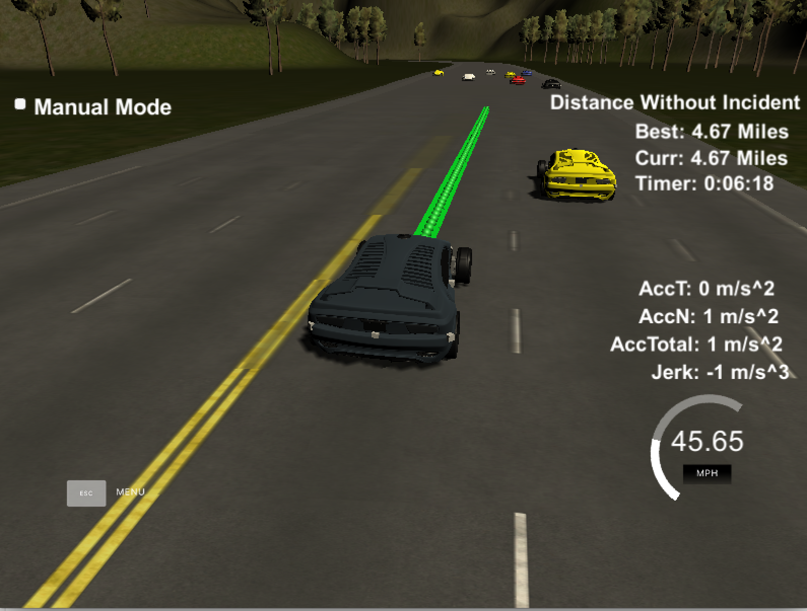

# CarND-Path-Planning-Project
Self-Driving Car Engineer Nanodegree Program

[](http://www.udacity.com/drive)
   
## Basic Build Instructions

1. Clone this repo.
2. Make a build directory: `mkdir build && cd build`
3. Compile: `cmake .. && make`
4. Run it: `./path_planning`.

## Simulator.
You can download the Term3 Simulator which contains the Path Planning Project from the [releases tab (https://github.com/udacity/self-driving-car-sim/releases).

## Result Screenshot


## Goals
The goal of the project is to safely navigate around a virtual highway under following constraints:  
1. The car should try to go as close as possible to the 50 MPH speed limit
2. The car should avoid hitting other cars at all cost as well as driving inside of the marked road lanes at all times
3. The car should be able to make one complete loop around the 6946m highway
4. The car should not experience total acceleration over 10 m/s^2 and jerk that is greater than 10 m/s^3

## Solution

### General Design  

The solution is mainly divided into two parts.  
One is the finite state machine, which sends out **behavior** command to trajectory generator. The FSM make a planning every 25 waypoints (0.5s)
<pre>
<code>
struct Behavior {
  int target_lane;
  double target_speed; // m/s
  vector<double> target_vehicle;
};
</code>
</pre>
The other is the trajectory generator, which generates smooth trajectory according to the behavior command from FSM.  

### Implementation
#### FSM
The FSM has 3 states, keep lane, lane change left and lane change right.  
When deciding which state to change, the FSM mainly considers the target lane's speed, which determine by the car in the target that is ahead of the ego car. When the lane speeds are the same for all target lanes, FSM will choose to stay in current lane.
<pre><code>
Behavior Vehicle::choose_next_state() {
  vector<States> states = successor_states();
  double min_cost = 100000000000.0;
  double cost;
  Behavior best_behavior;
  print_vehicle();
  cout << "* searching best move..." << endl;
  for (int i = 0; i < states.size(); i++) {

    States next_state = states[i];
    Behavior behavior = generate_behavior(next_state);
    cost = 1000 * (abs(max_speed - behavior.target_speed) / max_speed);
    
    // add some cost the make the car stay in current lane when all lane speed are the same
    if (target_lane != behavior.target_lane) {
      cost += 0.3;
    }

    if (cost < min_cost) {
      best_behavior = behavior;
      min_cost = cost;
    }

    cout << "* candidate state " << " " << endl;
    cout << "cost : " << cost << endl;
    print_behavior(behavior);
  }
  this->target_lane = best_behavior.target_lane;
  cout << "* best behavior" << endl;
  print_behavior(best_behavior);
  return best_behavior;
}
</code></pre>

### Trajectory generator
After reciving behavior command from FSM, the trajectory generator will generate a smooth trajectory according to the target speed and target lane defined in behavior command. The process is similar to the one introduced in the project workthrough, using spline.


---

## Dependencies

* cmake >= 3.5
 * All OSes: [click here for installation instructions](https://cmake.org/install/)
* make >= 4.1
  * Linux: make is installed by default on most Linux distros
  * Mac: [install Xcode command line tools to get make](https://developer.apple.com/xcode/features/)
  * Windows: [Click here for installation instructions](http://gnuwin32.sourceforge.net/packages/make.htm)
* gcc/g++ >= 5.4
  * Linux: gcc / g++ is installed by default on most Linux distros
  * Mac: same deal as make - [install Xcode command line tools]((https://developer.apple.com/xcode/features/)
  * Windows: recommend using [MinGW](http://www.mingw.org/)
* [uWebSockets](https://github.com/uWebSockets/uWebSockets)
  * Run either `install-mac.sh` or `install-ubuntu.sh`.
  * If you install from source, checkout to commit `e94b6e1`, i.e.
    ```
    git clone https://github.com/uWebSockets/uWebSockets 
    cd uWebSockets
    git checkout e94b6e1
    ```

